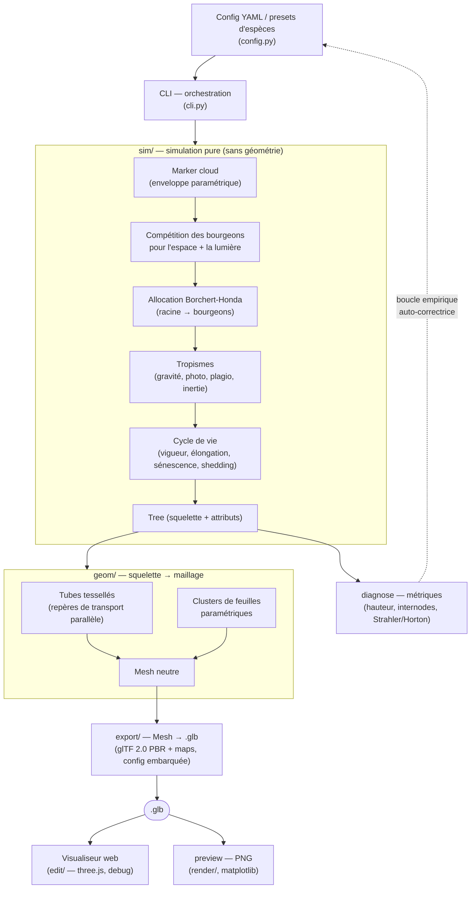

# palubicki

**Un simulateur d'arbres et de plantes : génération procédurale *réaliste*,
fondée sur la botanique.** L'objectif n'est pas de dessiner des arbres mais de
les *faire pousser* — la forme émerge de règles biologiques (compétition pour
l'espace et la lumière, allocation de ressources, tropismes, sénescence)
plutôt que d'être sculptée à la main. Chaque arbre est le résultat d'une
**simulation** année par année, pas d'un gabarit.

Le modèle est un **FSPM par colonisation de l'espace** (functional-structural
plant model) : des bourgeons-agents réagissent à des champs (marqueurs d'espace,
lumière) sur un graphe arborescent. Ce n'est pas un L-system — ce choix donne
nativement la compétition pour la lumière et les contraintes mécaniques. Base
théorique : Palubicki, Horel, Longay, Runions, Lane, Měch, Prusinkiewicz —
*Self-organizing tree models for image synthesis*, SIGGRAPH 2009
([papier](https://algorithmicbotany.org/papers/selforg.sig2009.html)).

La sortie est un `.glb` (glTF 2.0 binaire) ouvrable dans n'importe quel viewer
standard.

> **Comment on travaille ici** — beaucoup de réglages pilotent un comportement
> *émergent* qu'aucune table de constantes ne donne d'avance. On les accorde par
> une **boucle empirique auto-correctrice** : poser un départ plausible →
> observer les diagnostics → corriger un levier → recommencer jusqu'à ce que ça
> lise vrai. Voir [`docs/mindset-boucle-empirique.md`](docs/mindset-boucle-empirique.md).

## Install

```bash
pip install -e ".[dev]"
```

## Usage

```bash
# Arbre touffu en ellipsoïde (type chêne)
palubicki generate -o oak.glb \
  --envelope half_ellipsoid --envelope-radii 4 6 4 --seed 42

# Conifère
palubicki generate -o pine.glb \
  --envelope cone --envelope-radii 2 8 2 --w-gravity 0.5

# Vider tous les défauts pour démarrer un fichier de config
palubicki dump-defaults > my-config.yaml
palubicki generate -o tree.glb --config my-config.yaml

# Récupérer la config qui a produit un .glb existant
palubicki dump-config tree.glb > used.yaml
```

### Espèces

Presets packagés (`src/palubicki/configs/species/`), sélectionnés avec
`--species` : **oak**, **pine**, **birch**, **maple**. La précédence est
CLI > YAML > preset.

```bash
palubicki generate --species oak --seed 42 -o oak.glb
palubicki generate --species oak --w-gravity 0.5 -o oak_droopy.glb   # override
palubicki dump-defaults --species pine > my_pine.yaml                # point de départ
```

### Lumière (BHls)

`--light-enabled` couple la qualité des bourgeons à la lumière reçue
(Beer-Lambert sur une grille de voxels) : `Q = nb_markers × light_factor`. La
lumière pilote aussi le phototropisme local et la mort des branches en ombre
profonde. Le poids du phototropisme est désactivé par défaut — l'activer via
`tropism.w_phototropism` dans le YAML.

```bash
palubicki generate -o oak_light.glb \
  --envelope ellipsoid --envelope-radii 3 5 3 --light-enabled --seed 42
```

### Forêts + obstacles

`palubicki forest -o scene.glb --config scene.yaml`. Le YAML ajoute une section
`forest:` (plusieurs graines, chacune avec position, `seed`, `species`,
`overrides` en clés pointées) et une liste d'obstacles (AABB, Sphère, OBB, Mesh
OBJ). Les arbres se disputent un nuage de marqueurs et une grille de lumière
partagés ; les obstacles tuent des marqueurs, bloquent la croissance et occultent
la lumière.

### Aperçu PNG

```bash
pip install -e ".[render]"
palubicki preview tree.glb -o tree.png --size 1200x900 --elevation 15 --azimuth 60
palubicki preview forest.glb -o forest.png --bg transparent --no-leaves
```

Le rendu est **de niveau diagnostic** (silhouette + Lambert plat + couleurs de
matériau) : il sert à itérer sur les configs sans ouvrir chaque `.glb` dans un
viewer externe.

### Visualiseur web

```bash
pip install -e ".[edit]"
palubicki edit --species oak --seed 42
```

Ouvre `http://127.0.0.1:8765/` : panneau de paramètres (sliders, régénération à
la volée), viewer three.js (`OrbitControls`), aides de débogage (toggle feuilles,
wireframe, overlays des internes de sim : marqueurs, enveloppe, bourgeons,
branches élaguées avec timeline) et export `.glb` / YAML.

### Diagnostics chiffrés

`palubicki diagnose` est l'œil quantitatif de la boucle empirique : hauteur,
longueurs d'internode proximales vs distales, diamètre de base, indices de
Strahler / Horton, et flagging des bornes de littérature par espèce.

## Export & assets 3D

La sortie de base est un `.glb` (glTF 2.0 binaire) ouvrable dans n'importe quel
viewer (`generate` / `forest` ci-dessus). Au-delà, palubicki vise une véritable
**fabrique d'assets** : à partir du même graphe de simulation, produire des
modèles exploitables pour le **photoréalisme** (archviz, Blender/Cycles, Unreal
Lumen) *et* pour une **forêt de jeu vidéo** (instancing, LOD, impostors), avec
**rig de vent** pour l'animation et l'interaction.

Le principe directeur : **un master canonique** par arbre (PBR metallic-roughness
standard, non compressé, PNG — source de vérité unique) dont on dérive des
**profils cibles**. Le graphe `sim/` reste en lecture seule ; l'export *lève* ses
champs (`Internode.diameter` → raideur de vent, `axis_order` → niveaux/LOD,
`light_factor` → soleil/ombre, `birth_time` → âge d'écorce) vers des **attributs
portables** (`COLOR_n`/`TEXCOORD_n`) et des buffers d'instances. La réalité des
moteurs, pas l'élégance de la spec, fixe le plancher.

Déjà livré : la **forêt instanciée** (arbre-unité + `EXT_mesh_gpu_instancing`,
P0), le **vent hiérarchique** par attributs-sommets + `TANGENT` (P1), et le
**master photoréaliste** (P2) — cartes normal / ORM packé / specular cuticule +
lame de feuille géométrique courbée, gestion correcte des espaces colorimétriques
(baseColor sRGB, données linéaires sur leurs propres canaux), et le contre-jour
des feuilles en métadonnée `KHR_materials_diffuse_transmission` (consommé par les
shaders subsurface par-moteur). Reste à venir : profils cibles + gate de
validation (P3), LOD + impostor (P4), vent skinné hero (P5).

```bash
# Cible (en construction — épic #53) :
palubicki bake oak.glb --profile web      # meshopt + KTX2 + instancing + LOD/impostor
palubicki bake oak.glb --profile unreal   # non compressé + PNG + extensions import-safe
```

- **Conception & plan** : [`docs/export-pipeline-design.md`](docs/export-pipeline-design.md)
  — architecture en couches, rig de vent, forêts instanciées, et le plan
  d'implémentation (P0 forêt → P1 vent → P2 photoréalisme → P3 profils → P4
  LOD/impostor → P5 skin).
- **Référence technique** : [`docs/render-pipeline.md`](docs/render-pipeline.md).
- **Suivi** : épic GitHub [#53](https://github.com/julien-riel/palubicki/issues/53).

## Architecture

Le pipeline est strictement étagé : la **simulation** ne connaît ni géométrie ni
glTF ; la **géométrie** ne connaît pas le format d'export ; chaque couche produit
un artefact neutre consommé par la suivante.



- `src/palubicki/sim/` — simulation pure (markers, buds, BH, tropismes, shedding). Pas de géométrie, pas de glTF.
- `src/palubicki/geom/` — squelette → tubes tessellés (repères de transport parallèle) + clusters de feuilles paramétriques. Produit un `Mesh` neutre.
- `src/palubicki/export/` — `Mesh` → `.glb`. glTF 2.0 PBR metallic-roughness : maps normal/ORM/specular, vent par attributs portables, forêt instanciée ; extensions import-safe + métadonnée prospective.
- `src/palubicki/render/` — `.glb` → PNG (diagnostic, matplotlib).
- `src/palubicki/edit/` — visualiseur web three.js + serveur de re-simulation live.
- `src/palubicki/cli.py` — orchestre.

La boucle pointillée `diagnose → config` est le cœur méthodologique du projet :
on accorde les paramètres en réagissant aux métriques mesurées, pas à des valeurs
posées d'avance.

## Configuration

Tous les paramètres sont exposés en YAML. Les flags CLI exposent les plus
tweakés ; le reste est YAML-only. `palubicki dump-defaults` vide le schéma complet
avec les défauts. La config effective (overrides inclus) est embarquée dans
`asset.extras.config` du `.glb` produit, pour la reproductibilité.

## Tests

```bash
pytest                  # tests unitaires (rapides)
pytest -m slow          # intégration + goldens
pytest --cov            # rapport de couverture
```

## Documentation

L'architecture du système est décrite dans `docs/` (état actuel — l'historique
est dans git) :

- [`docs/simulation-loop.md`](docs/simulation-loop.md) — la boucle de simulation, du général au détaillé.
- [`docs/tree-data-model.md`](docs/tree-data-model.md) — le graphe arborescent (Node / Internode / Bud / Leaf).
- [`docs/render-pipeline.md`](docs/render-pipeline.md) — du graphe au `.glb` : géométrie, matériaux, format, et la matrice des écarts vs. un pipeline de production.
- [`docs/export-pipeline-design.md`](docs/export-pipeline-design.md) — la conception & le plan de la fabrique d'assets (master + profils, vent, forêts instanciées, LOD/impostors).
- [`docs/botany/plant-structure.md`](docs/botany/plant-structure.md) — primer de morphologie végétale (le vocabulaire mappé sur les structures de données).
- [`docs/botany/code-support-matrix.md`](docs/botany/code-support-matrix.md) — matrice support / billet : chaque concept botanique du primer, supporté ou non dans le code, avec l'issue qui le corrige.
- [`docs/botany/realism-assessment.md`](docs/botany/realism-assessment.md) — évaluation du réalisme, lue depuis le code.
- [`docs/botany/sources.md`](docs/botany/sources.md) — bibliographie primaire.
- [`docs/mindset-boucle-empirique.md`](docs/mindset-boucle-empirique.md) — la méthode de travail (boucle empirique auto-correctrice).
- [`docs/roadmap.md`](docs/roadmap.md) — ce qui reste à faire.
