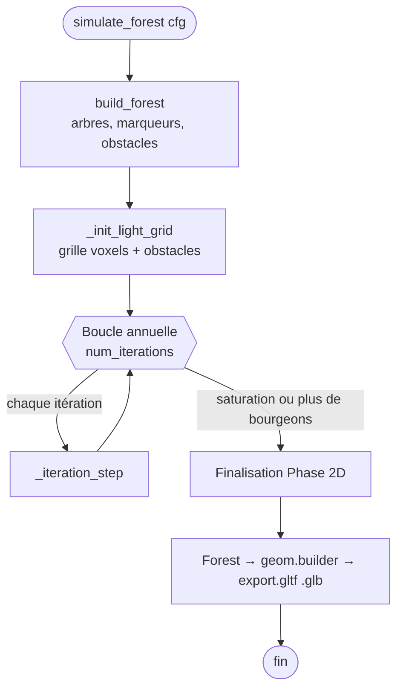
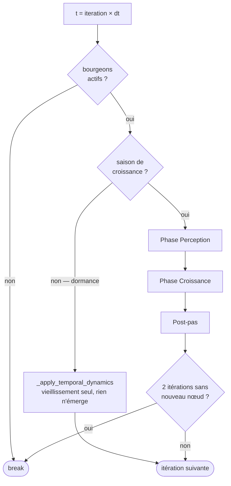
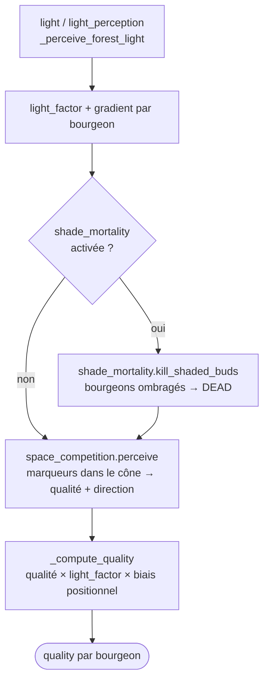
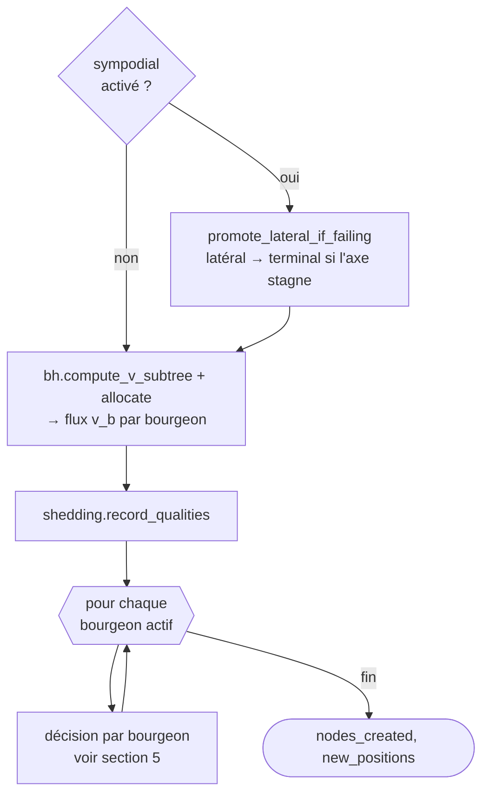
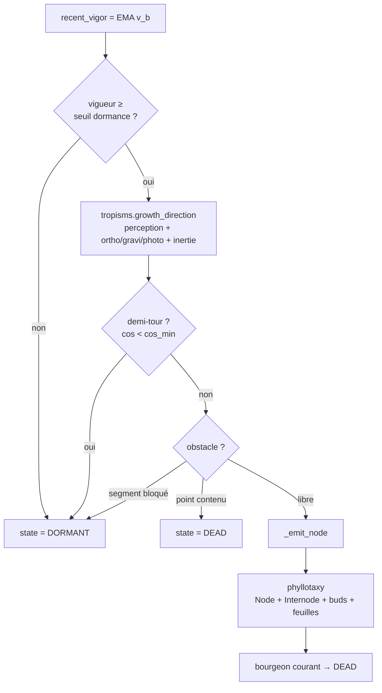
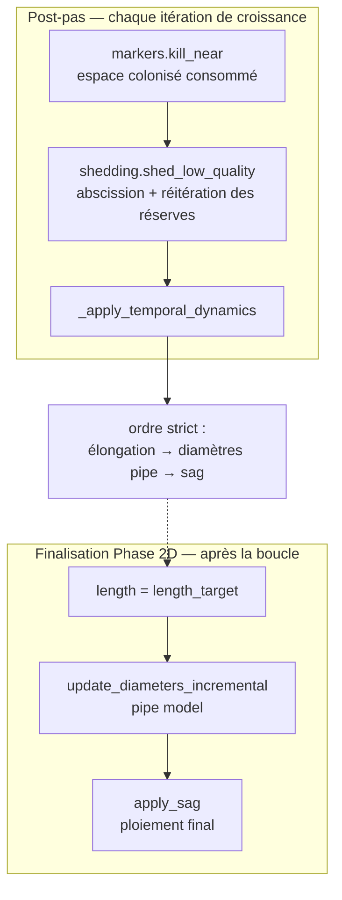

# Boucle de simulation — `sim/simulator.py`

Vue d'ensemble de `simulate_forest`, décomposée du plus général au plus
détaillé. Chaque section zoome sur une partie de la précédente.

---

## 1. Vue d'ensemble

Les trois grandes phases : construire la forêt, itérer année par année,
puis finaliser et exporter.

---

## 2. Une année : `_iteration_step`

Chaque itération choisit une branche selon le calendrier (`Clock`) et l'état
des bourgeons.

---

## 3. Phase Perception

Calculée **une fois par itération**, sur l'union des bourgeons de tous les
arbres. Produit la `quality` par bourgeon qui pilotera la croissance.

> `_compute_quality` combine la qualité des marqueurs, le `light_factor` et le
> biais d'éclosion positionnel (`bud_break_bias` : acro / méso / basitone).

---

## 4. Phase Croissance — `_grow_tree`

Pour chaque arbre. Allocation Borchert-Honda du flux de vigueur, puis une
passe bourgeon-majeure qui émet **au plus un** internode par bourgeon.

---

## 5. Décision d'un bourgeon

Le cœur de la croissance : chaque bourgeon décide de rester dormant ou
d'émettre un nouveau nœud.

> `_emit_node` crée le `Node`, l'`Internode` (avec `vigor = v_b`), le bourgeon
> terminal, les latéraux, les bourgeons de réserve, et les feuilles
> (azimuts phyllotaxiques). Le bourgeon courant devient `DEAD`.

---

## 6. Post-pas et finalisation

> **Ordre imposé** dans `_apply_temporal_dynamics` : longueurs d'abord (le sag
> lit la charge `longueur × diamètre²`), puis diamètres (le sag lit le
> diamètre), puis sag en dernier.
