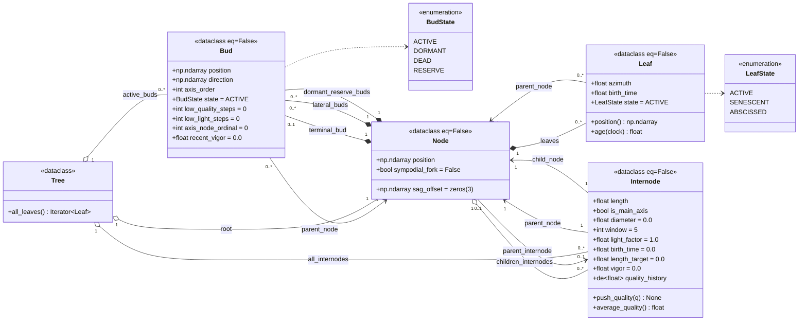

# Structure de données — `sim/tree.py`

Le graphe arborescent du FSPM par colonisation de l'espace : un squelette
`Node` ↔ `Internode`, avec `Bud` (méristèmes) et `Leaf` accrochés aux nœuds.

## Notes

- **`Bud`** (méristème-agent) — `axis_order` : 0 = tronc, +1 par ordre de
  branchaison. `axis_node_ordinal` : rang phyllotaxique **par axe** (pilote
  l'azimut de divergence, #24). `recent_vigor` : EMA du flux Borchert-Honda
  `v_b` → décision de dormance par hystérésis.
- **`Leaf`** — `position` est **dérivée** : `parent_node.position +
  parent_node.sag_offset` (suit automatiquement le ploiement / l'élongation).
- **`Internode`** — `vigor` est le flux `v_b` qui a produit l'entre-nœud
  (→ rayon de pointe pipe-model + diagnostics). `length` vs `length_target` :
  élongation progressive (sigmoïde). `quality_history` : fenêtre glissante
  → abscission (shedding).
- **`Tree`** — `active_buds` est la file de travail de la boucle de
  croissance ; `all_internodes` est un index plat pour `radii` / `sag` /
  diagnostics.
